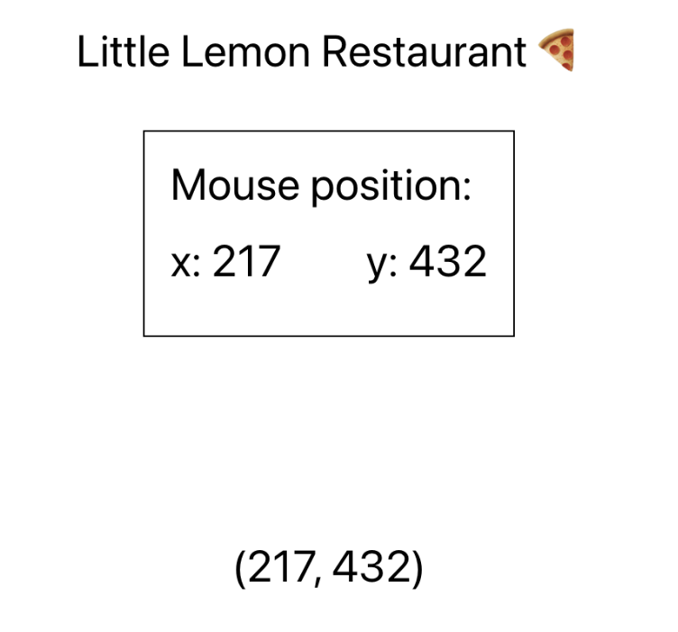

# Instructions

## Task

You've learned about render props and how it's a viable alternative to Higher Order Components to encapsulate cross-cutting concerns.
In a previous video, you saw a possible implementation of a mouse position tracker using Higher Order Components.
In this exercise, you'll implement the same specifications but using a render prop component instead.

**Note:** Before you begin, make sure you understand how to work with the Coursera Code Lab for the [Advanced React course](https://www.coursera.org/learn/advanced-react/supplement/htaLX/working-with-labs-in-this-course).

## Steps

### **Step 1**

Open the `App.js` file.

Complete the implementation of the `MousePosition` component. Specifically, you'll need to:
- Implement the body of `handleMousePositionChange` inside `useEffect`. Use `e.clientX` and `e.clientY` to get the mouse position from the event object.
- Implement the return statement of the component.

### **Step 2**

Tweak the implementation of `PanelMouseLogger`. The requirements are:
- The component should not receive any props.
- The component should not have any `if` statements.
- The component should leverage the `MousePosition` `render` prop to show the coordinates in a panel fashion. The panel UI is already provided to you, your goal is to connect the UI with the mouse position data.

### **Step 3**

Tweak the implementation of `PointMouseLogger`. The requirements are:
- The component should not receive any props.
- The component should not have any `if` statements.
- The component should leverage the `MousePosition` `render` prop to show the coordinates in a point representation. The point UI is already provided to you, your goal is to connect the UI with the mouse position data

Save all the changes and run the app.
Preview the updates in the browser, and confirm that the page shows 2 distinct interfaces that display the safe information (mouse position) in different fashion, one as a panel and another as a point coordinates. 

