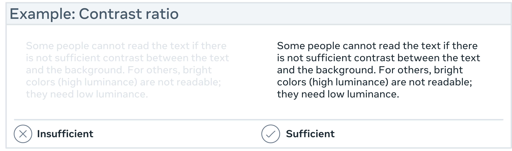
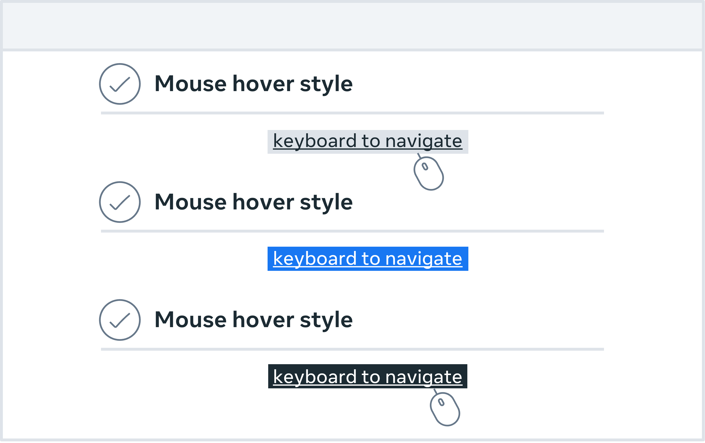
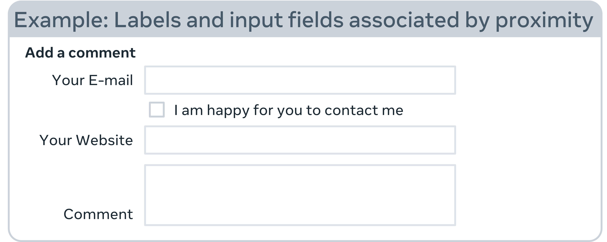
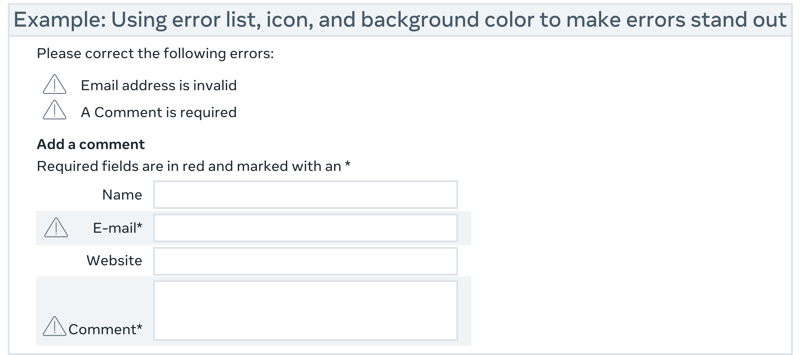
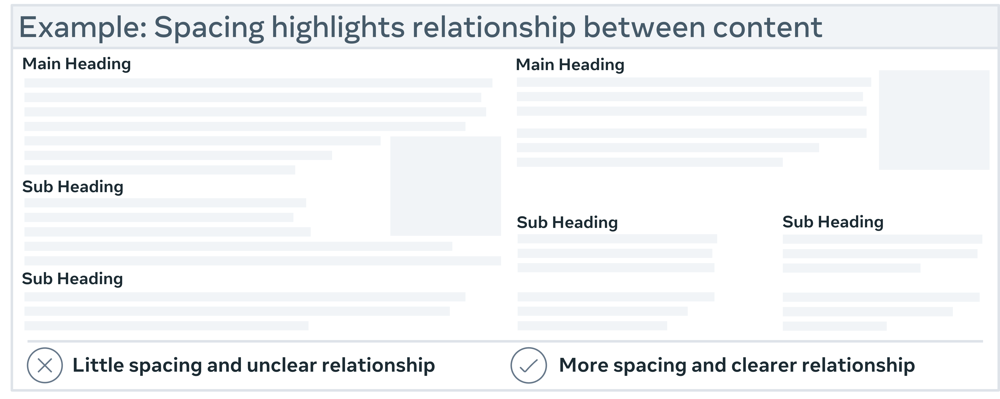
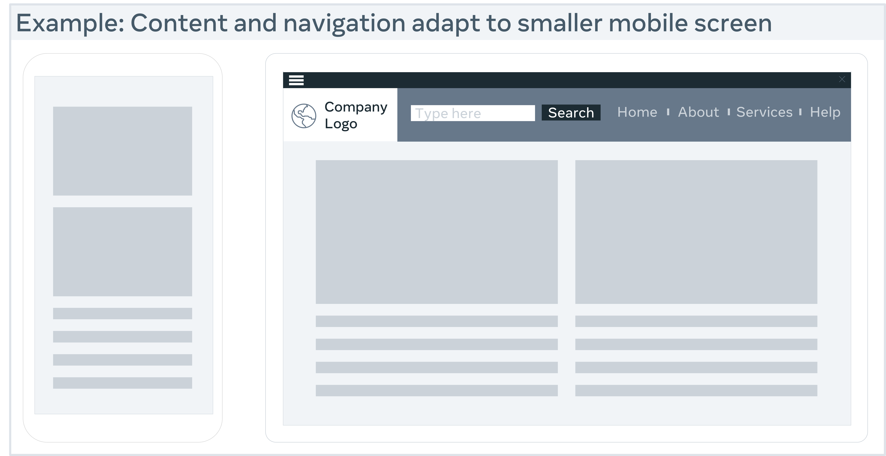
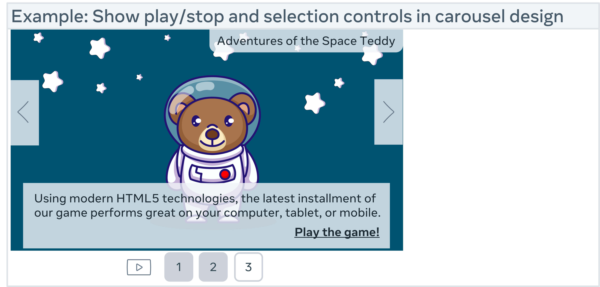

# Designing for accessibility

Accessibility enables people with disabilities to interpret, understand, navigate, interact with and contribute to the web. Think of a world in which developers know everything there is to know about accessibility. You design it and they build it perfectly. However, if you only consider the design of a product, it may make it difficult for people with disabilities to use it.

Choosing which 'needs' to design for is one of the most common issues when designing for accessibility. We don't intentionally exclude users; rather, 'we don't know what we don't know'. As a result, there is a lot to learn about accessibility. Let's consider some accessibility guidelines that may guide you in the right direction. These guidelines cover the major points you need to know for your products to be design-ready and meet the Section 508 and Web Content Accessibility Guidelines (WCAG) 2.0 minimum standards. The rest is up to development and quality assurance testing. For a detailed explanation of accessibility, you can access the WCAG 2.0.

## Access to information is not a barrier to innovation

Accessibility may not persuade you to produce an ugly, boring or cluttered product. It may initiate a set of constraints you'll need to consider as you design. These design constraints will offer you new ideas to explore, resulting in improved products for all your users.

Bear in mind that you may not want to design for your peers as you read these guidelines. What is important is that you design for a wide range of users who will engage with your products, including people who are blind, color blind or have poor eyesight, those who are deaf or have poor hearing, people with permanent or temporary mobility impairments and people with cognitive disabilities. When you design, you may want to take all the possible users into consideration. They can be young, old, power users, casual users and those who purely enjoy a good experience.

## Don't use color alone to convey information

Don't use color alone to convey information. This may be useful for users who are unable or have difficulty distinguishing one color from another. People who are colorblind (1 in 12 men and 1 in 200 women), have low vision (1 in 30 people) or are blind are included (1 in 188 people).

While color can be used to convey information, it should not be the only way to do so. When using color to distinguish elements, it may be useful to provide additional identification that is not dependent on color perception. To indicate required form fields, you can use an asterisk in addition to color and labels to differentiate areas on graphs.

## Provide sufficient contrast between foreground and background

The contrast between the foreground and background colors must be sufficient. This includes text on images, gradient backgrounds, buttons and other elements. This does not apply to logos or incidental text, such as text found in a photograph. A contrast ratio between text and background of at least 4.5 to 1 is recommended in the Web Content Accessibility Guidelines. The minimum drops to 3 to 1 if your font is at least 24 pixels or 19 pixels bold.

## Ensure that interactive elements are easily identifiable

To make interactive elements such as links and buttons easier to identify, consider using distinct styles. This can be done by, for example, changing the appearance of links on mouse hover, keyboard focus and touch-screen activation. Ensure that the interactive elements' styles and naming are consistent throughout the website. Some users may not be able to use a mouse and may rely solely on their keyboard to navigate web pages. It is critical that users can use the keyboard to access all interactive elements and that it is clear which element is interactive. A border or highlight that moves as you tab through the web page could be used to indicate visible keyboard focus.

## Ensure that form elements include clearly associated labels

It is important that each field has a descriptive label, except for checkboxes and radio buttons. Checkboxes are typically placed to the right, and labels are from left to right. Languages are positioned to the left or above the area. It is always good to check that there isn't too much space between the labels and the fields.

## Make navigation options clear and consistent

Navigation across pages on a website should be consistent in terms of naming, styling and positioning. A good tactic is to provide more than one way to navigate your websites, such as a site search or a site map. You can also use orientation cues, such as breadcrumbs and clear headings, to help users understand where they are on a website or page.

## Provide easily identifiable feedback

Feedback for interactions such as form submission confirmation and notifying the user when something goes wrong can be very valuable. If there are any instructions, they should be clear. Important feedback that includes user action should be displayed in a place where it can easily be seen.

## Use headings and spacing to group related content

Whitespace and proximity help to highlight relationships between content. Headings can help you to organize content, decrease clutter and make it simpler to scan and understand.

## Design for different viewport sizes

Think about how page information is displayed in different viewport sizes, such as mobile phones or zoomed browser windows. The placement and appearance of main elements, such as the header and navigation, can be changed to make the most of the space. It is helpful to check that the text size and line width are set to maximize readability and legibility.

## Provide controls for content that starts automatically

You can allow users to stop any animations or auto-playing sounds with visible controls. This holds true for carousels, image sliders, background music and videos.

# Final thoughts

The more sensitive you are to your users' needs, the more accessible your design will be. Users within your target demographic, users outside your target demographic, users with disabilities and even users from different cultures and countries should all be included. Once you have a keen understanding of your user's needs, it may help you to create more accessible experiences for them.
