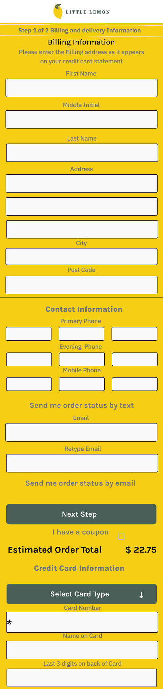
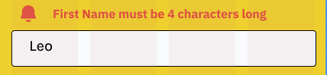
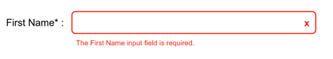
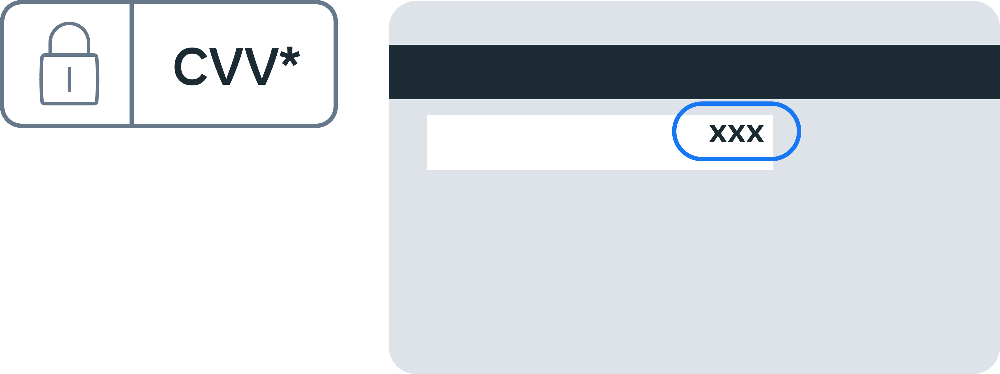

# Little Lemon form breakdown

## The importance of forms

Anyone who uses an app or website has a specific goal in mind. A form is frequently the only thing that stands between the user and their goal. Forms continue to be one of the essential types of user interactions on the web and in apps. Forms are frequently regarded as the final step in achieving one's objectives. Users should be able to complete forms quickly and easily. Let's examine Little Lemon's current checkout form in detail, which demonstrates some common errors in form design.

## The layout

First, the text fields where the user needs to input data are in the center and not aligned to the left as in best practice. The checkout button is not apparent and there is no basket or information about what the user is buying.

## What about the length?

### Include a progress indicator

Typically, checking out is a multi-step process. This means the customer will have to go through several steps before his or her order is complete. To make this process usable, include a progress indicator that indicates where the customer is in the checkout process and how much time is left to complete the process.

### Include only vital fields

A record number of shoppers are researching potential purchases on their smartphones. Meanwhile, the bigger question is whether those users are willing to purchase on their mobile devices. Everyone has answered dreaded questions, such as 'How did you hear about us?' While they may serve the seller, they do nothing for the buyer.

While these questions are annoying on a desktop, they can be fatal on mobile. In his excellent book Web Forms: Filling in The Blanks, Luke Wroblewski stated:

"Any question you ask people in a Web form requires them to parse it, formulate a response and then input their answer in the affordance you have provided on the form. Being vigilant about every question you ask allows you to remove questions that are not absolutely necessary or can be asked at a better time or place or can be inferred automatically. And the fewer questions you ask, the better the odds are of people completing your forms quickly and easily."

Little Lemon's checkout demonstrates how a simple experience can quickly become complicated. Pages display unnecessary fields such as Middle Initial, Evening Phone and Mobile Phone, while breaking fields apart, the Address field has three imposing lines and a City (rather than just one for a postal code), plus the user is expected to retype their email address.

### Required fields and errors

After filling out the form fields and clicking submit, an error message is received, preventing a user from continuing: "First Name must be at least 4 characters." There are two issues to address based on the screenshot:

First Name is not a required field because it lacks an asterisk (\*) to indicate that the form field requires input. Using an asterisk to indicate required fields on forms, according to the Nielsen Norman Group, is a simple way to improve usability. The form field has a minimum character count. Small details like this have a significant impact on the end-user experience in user-centered design. At least 220 three-character names exist. In some ways, this is dehumanizing because the system regards someone as unreal or invalid.

#### Required fields: a solution

An asterisk or the text required indicates that a form field is required. Check that all required form fields are marked. Include feedback to highlight errors such as empty required fields, invalid email (for example, when the email lacks a '@' sign), and so on. Why do we even have a limit?

### Character limits

Character limits are a type of technical limitation that should be brought to light during developer-designer collaboration. Lower- and upper-character limits would be required by a system for two reasons: security and storage.

Validation should be performed on the input to ensure that it is of the correct type, length, format, and range. As a result, when users log in to access information, it can be validated against the database. A vulnerability that allows users to enter fields freely would result in inaccurate data and the possibility of bots breaking into your system.

Maximum character limits are used in storage because it is impossible to store a name that is legitimately 1,073,741,823 bytes long. The longest name in the world is only 747 characters long.

#### Character limits: a solution

Remove the minimum number of characters requirement. Implement a maximum character requirement that works for the vast majority of names in the database - 50 characters are an excellent place to start. Why even have a limit? Character limits are a type of technical limitation that _should_ be brought to light during developer-designer collaboration. A system would require lower- and upper-character limits for security and storage.

Validation should be performed on the input to ensure that it is of the correct type, length, format and range. As a result, when users log in to access information, it can be validated against the database. A vulnerability that allows users to enter fields freely would result in messed-up data and the possibility of bots breaking into your system.

### Email

The user is only ordering a meal, so do they need to confirm their email? If it is important, consider that when users are confirming their email in separate fields, they frequently make typos. The requirement that users type their email in two text fields increases the likelihood of typos.

#### Email confirmation: a solution

So, the best approach would be to send a confirmation link to the user. This is the most user-friendly approach because it requires the least amount of user effort.

### Payment not explaining the CVV

Like AVS, CVV or CVC is an ambiguous acronym. Make sure to explain it.

#### CVV: a solution

The image below depicts that CVV is located on the back of your bank card, and it is the last three digits printed.

# Final thoughts

One of the most frustrating aspects of using the internet is form validation. If it's unclear to a user what they are doing wrong and there's no easy way to fix it, they are much more likely to give up and move on to another site when filling out a form.
